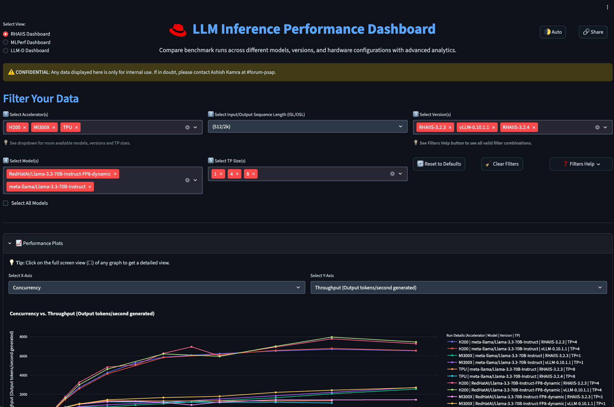
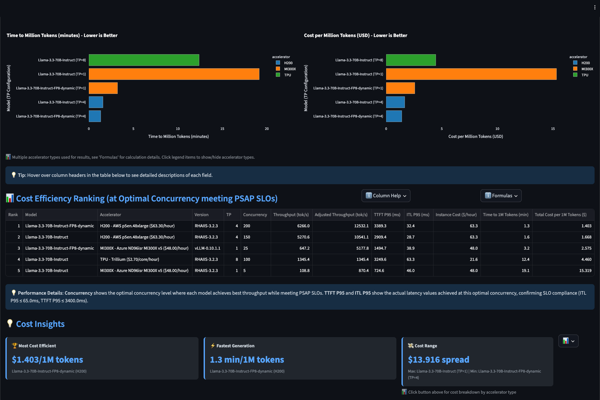
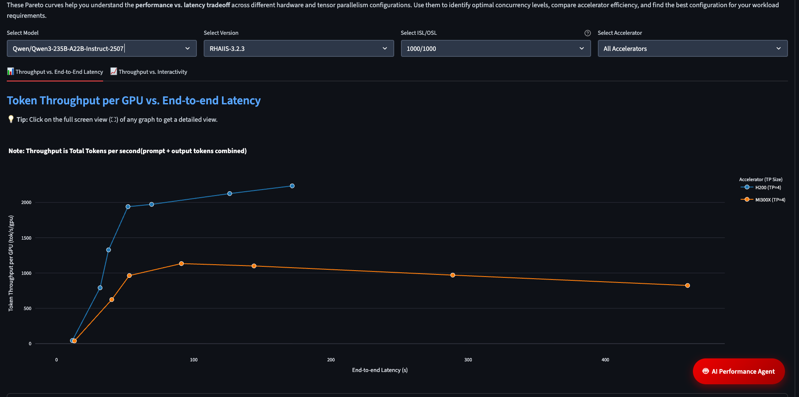
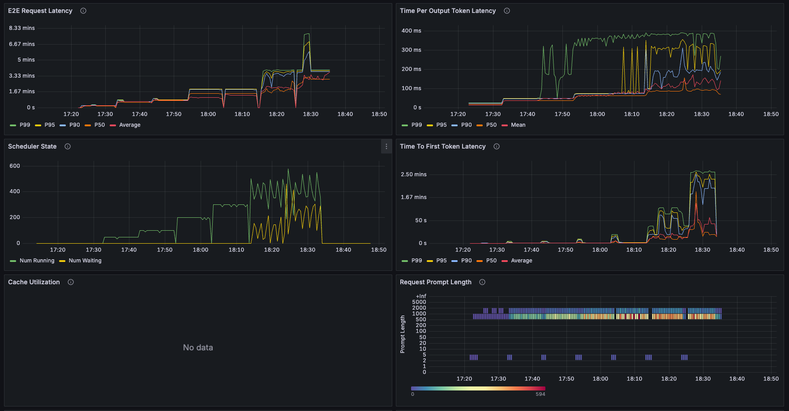
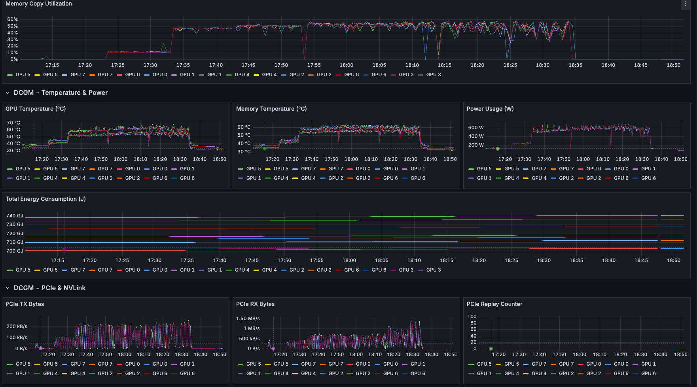
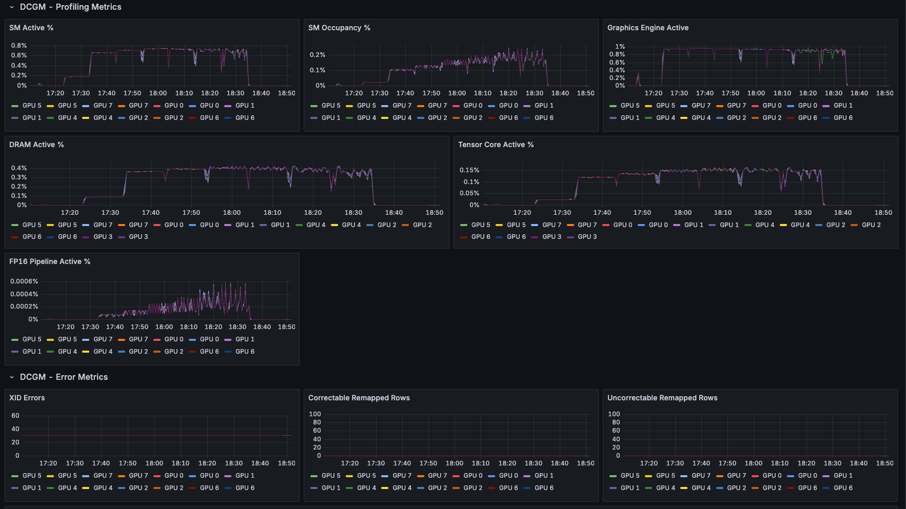

# Performance Benchmarking Methodology for LLMs

> **Comprehensive guide to performance benchmarking methodologies and GuideLLM configurations used for RHAIIS (Red Hat OpenShift AI Server)**

[](https://www.redhat.com/en/technologies/cloud-computing/openshift/openshift-ai)
[](https://github.com/neuralmagic/guidellm)
[](https://github.com/vllm-project/vllm)

---

## 📋 Table of Contents

- [Summary](#-summary)
- [Benchmarking Overview](#benchmarking-overview)
- [Why GuideLLM?](#why-guidellm)
- [GuideLLM Configuration](#-guidellm-configuration)
- [Test Profiles (ISL/OSL)](#-test-profiles-islol)
- [Model Inventory and Runtime Configurations](#-model-inventory-and-runtime-configurations)
- [Runtime Parameters](#-runtime-parameters)
- [Hardware Platforms](#hardware-platforms)
- [Benchmark Workflow Execution](#-benchmark-workflow-execution)
- [Key Metrics](#-key-metrics)
- [Quick Reference](#-quick-reference)
- [Additional Resources](#-additional-resources)

---

## 📄 Summary

This document outlines the **standardized performance benchmarking methodology** used by the Red Hat Performance and Scale (PSAP) team for validating LLM inference workloads on Red Hat OpenShift AI.

Our approach uses **GuideLLM** as the primary benchmarking tool to measure throughput and latency across:
- ✅ Multiple models (Dense, MoE)
- ✅ Hardware accelerators (H200, MI300X, TPU, Spyre)
- ✅ Inference engines (vLLM, SGLang, TPUs, Spyre)
- ✅ Workload profiles (Balanced, Decode-Heavy, Prefill-Heavy, Long-Context)

**📅 Date:** 12/05/2025
**👥 Authors:** PSAP team
**💬 Slack:** [#forum-psap]

---

## Benchmarking Overview

Our performance validation focuses on comprehensive inference performance measurement across multiple dimensions:

### Throughput Metrics

| Metric | Description |
|--------|-------------|
| **Request Throughput** | Requests per second (req/s) |
| **Output Token Throughput** | Output tokens generated per second |
| **Token Generation Throughput** | Total tokens/sec across all requests |
| **Total Throughput** | Combined input + output tokens/sec |

### ⚡ Latency Metrics

#### End-to-End Latency
- P50, P95, P99 percentiles
- Request Latency Median
- Request Latency Min/Max

#### Token-Level Latency
| Metric | Description | Percentiles |
|--------|-------------|-------------|
| **TTFT** (Time to First Token) | Time from request to first token | P50, P95, P99 |
| **TPOT** (Time Per Output Token) | Average time between tokens | P1, P50, P99 |
| **ITL** (Inter-Token Latency) | Token-to-token generation time | P50, P95, P99 |

### Efficiency & Scalability

- **Efficiency:** Output tokens/sec per Tensor Parallel (TP) unit
- **Scalability Testing:**
  - Concurrency levels: `1, 50, 100, 200, 300, 500, 650`
  - Resource utilization: GPU memory, compute, power

### Cross-Release Validation

- RHAIIS version comparisons (e.g., 3.2.3 vs 3.2.4)
- vLLM runtime version impact
- Quantization effectiveness (FP8 vs FP16)

---

## Why GuideLLM?

GuideLLM is our benchmarking client of choice because:

✅ **Consistent & Reproducible:** Standardized methodology across all tests  
✅ **Concurrent Request Patterns:** Critical for realistic workload simulation  
✅ **Detailed Metrics:** TTFT, ITL, throughput, and latency percentiles  
✅ **Progressive Concurrency Sweeps:** Identify saturation points systematically

---

## GuideLLM Configuration

### Default Settings

All benchmarks use these consistent GuideLLM parameters unless specifically overridden:

```yaml
backend_type: "openai_http"     # OpenAI-compatible HTTP API
rate_type: "concurrent"         # Concurrent request simulation
request_timeout: 1000           # Request timeout (seconds)
max_seconds: 600                # 10 minutes per profile
```

> 📘 **Note:** For detailed supported parameters, review the [GuideLLM README](https://github.com/neuralmagic/guidellm).

### Concurrency Sweep

```
1, 50, 100, 150, 200, 300, 400, 500, 650
```

**Rationale:**

| Concurrency Level | Purpose |
|-------------------|---------|
| `1` | Baseline single-user performance |
| `50-200` | Typical production load ranges |
| `300-500` | High-load scenarios |
| `650+` | Saturation testing to identify breaking points |

### GuideLLM Command Template

```bash
guidellm benchmark \
  --target=http://<SERVICE_NAME>.<NAMESPACE>:PORT \
  --backend-type=openai_http \
  --model=<MODEL_NAME> \
  --rate-type=concurrent \
  --processor=<MODEL_NAME> \
  --max-concurrency=1000 \
  --data=prompt_tokens=<ISL>,output_tokens=<OSL> \
  --max-seconds=600 \
  --rate=1,50,100,200,300,500,650 \
  --output-path=./results.json
```

> 📘 **Note:** For detailed supported key parameters, review the [GuideLLM README](https://github.com/neuralmagic/guidellm).

---

## Test Profiles (ISL/OSL)

We use the following profiles to evaluate performance across different workload patterns. Each profile uses **synthetic datasets downloaded from HuggingFace** at runtime, ensuring consistent and reproducible benchmarking across all test runs.

### Profile 1: Balanced Workload

```yaml
ISL (Input Sequence Length): 1000 tokens
OSL (Output Sequence Length): 1000 tokens
```

**Characteristics:**
- Balanced prefill and decode workload
- Simulates typical conversational AI use cases

**Use Cases:**
- Question answering with moderate context
- Summarization tasks
- General chatbot interactions

**GuideLLM Flag:**
```bash
--data=prompt_tokens=1000,output_tokens=1000
```

---

### Profile 2: Decode-Heavy Workload

```yaml
ISL: 512 tokens (with variability)
OSL: 2048 tokens
```

**Characteristics:**
- **Decode-heavy workload**
- Tests sustained token generation performance
- Variable input length: `mean=512, stdev=128, min=1, max=1024`
- Variable output length: `mean=2048, stdev=512, min=1, max=4096`
- Stresses decode throughput and KV cache efficiency

**Use Cases:**
- Long-form content generation
- Code generation
- Creative writing

**GuideLLM Flag:**
```bash
--data=prompt_tokens=512,prompt_tokens_stdev=128,prompt_tokens_min=1,prompt_tokens_max=1024,\
output_tokens=2048,output_tokens_stdev=512,output_tokens_min=1,output_tokens_max=4096
```

---

### Profile 3: Prefill-Heavy Workload

```yaml
ISL: 2048 tokens
OSL: 128 tokens
```

**Characteristics:**
- **Prefill-heavy workload**
- Tests prompt processing efficiency
- Stresses KV cache creation

**Use Cases:**
- Document classification with large context
- Sentiment analysis on long texts
- Extractive summarization
- Short answers from long documents

**GuideLLM Flag:**
```bash
--data=prompt_tokens=2048,output_tokens=128
```

---

### Profile 4: Long-Context Workload

```yaml
ISL: 8000 tokens
OSL: 1000 tokens
```

**Characteristics:**
- **Long-context workload**
- Tests LLM models' ability to handle extended context windows
- Stresses KV cache capacity

**Use Cases:**
- Retrieval-Augmented Generation (RAG)
- Document analysis on large texts
- Long conversation history processing

**GuideLLM Flag:**
```bash
--data=prompt_tokens=8000,output_tokens=1000
```

> ⚠️ **NOTE:** Profiles with higher ISL (8k+) may require `max-model-len >= 8192` in vLLM configuration.

---

##  Model Inventory and Runtime Configurations

Our performance validation uses LLMs representing different sizes, architectures, and quantization methods:

### Dense Models (Small/Large)

| Model | Quantization | Size |
|-------|-------------|------|
| `meta-llama/Llama-3.3-70B-Instruct` | BF16 | 70B |
| `RedHatAI/Llama-3.3-70B-Instruct-FP8-dynamic` | FP8 | 70B |
| `meta-llama/Llama-3.1-405B-Instruct` | BF16 | 405B |
| `RedHatAI/Meta-Llama-3.1-405B-Instruct-FP8-dynamic` | FP8 | 405B |

### MoE Models (Mixture of Experts)

#### Small MoE
| Model | Quantization | Size |
|-------|-------------|------|
| `Qwen/Qwen3-235B-A22B-Instruct-2507` | BF16 | 235B (22B active) |
| `RedHatAI/Qwen3-235B-A22B-FP8-dynamic` | FP8 | 235B (22B active) |

#### Large MoE
| Model | Quantization | Size |
|-------|-------------|------|
| `Llama-4-Maverick-17B-128E-Instruct` | BF16 | 17B per expert, 128 experts |
| `RedHatAI/Llama-4-Maverick-17B-128E-Instruct-FP8` | FP8 | 17B per expert, 128 experts |
| `openai/gpt-oss-120b` | BF16 | 120B |
| `RedHatAI/gpt-oss-120b` | FP8 | 120B |
| `deepseek-ai/DeepSeek-R1-0528` | BF16 | Variable |

---

## 🔧 Runtime Parameters

### vLLM Runtime Parameters

```yaml
# Core Configuration
max-model-len: 8192                 # Maximum sequence length
gpu-memory-utilization: 0.92        # Reserve 8% for safety
tensor-parallel-size: [1, 4, 8]     # GPU shards for model partitioning
trust-remote-code: true             # Required for custom model architectures

# Logging
uvicorn-log-level: "debug"          # Enable detailed logging
disable-log-requests: true          # Reduce log verbosity

# Caching (for benchmarking baseline)
no-enable-prefix-caching: true      # Disable prefix caching*
disable-radix-cache: true           # Disable radix-attention KV cache

# Request Handling
max-running-requests: 512           # Max concurrent in-flight requests
cuda-graph-max-bs: 512              # Max batch size for CUDA Graph capture

# Memory Management
mem-fraction-static: 0.90           # GPU memory for model + KV cache
context-length: 8192                # Maximum sequence length (input + output)

# Streaming
stream-interval: 10
decode-log-interval: 1
```

> ⚠️ **Note:** `no-enable-prefix-caching` is **NOT recommended for production**. We use this parameter only to establish a true baseline without caching effects.

### TPU Runtime Parameters

```yaml
no-enable-prefix-caching: true
max-model-len: 4096  # TPU performance is dependent on max-model-len
```

> 💡 Set `max-model-len` to the minimum that supports your use case.

### Spyre Runtime Parameters

```yaml
no-enable-prefix-caching: true
tensor-parallel-size: [1, 4]
max-model-len: [3072, 32768]
max-num-seqs: [16, 32]
```

---

## Hardware Platforms

### NVIDIA H200

| Specification | Value |
|---------------|-------|
| **GPU Memory** | 141GB HBM3 |
| **Memory Bandwidth** | 4.8 TB/s |
| **FP8 Tensor Cores** | Yes (2x speedup vs BF16) |
| **Configuration** | 8x H200 per node |

---

### AMD MI300X

| Specification | Value |
|---------------|-------|
| **GPU Memory** | 192GB HBM3 |
| **Memory Bandwidth** | 5.3 TB/s |
| **FP8 Support** | Yes (via ROCm) |
| **Configuration** | 8x MI300X per node |

---

### Google Cloud TPU

| Specification | Value |
|---------------|-------|
| **Configuration** | 4x v6e (32GB) on GCP |
| **Interconnect** | ICI (800 Gbps/ICI port) |
| **Runtime Version** | v2-alpha-tpuv6e |

---

### IBM Spyre

| Specification | Value |
|---------------|-------|
| **Configuration** | 4x DD2 |
| **Architecture** | ppc64le (Power) |

---

## Benchmark Workflow Execution

To ensure consistency and reproducibility across all model/hardware combinations, we follow a **standardized 5-step workflow**:

![Benchmark Workflow Diagram]

### Step 1: Model Deployment 

- Deploy the target model on OpenShift using **KServe InferenceService**
- Configure vLLM runtime with model-specific parameters (`tensor-parallel-size`, `max-model-len`, etc.)
- Specify hardware accelerator type (H200, MI300X, TPU, Spyre)
- **Isolation:** No other workload runs on the same node to prevent noisy neighbors

### Step 2: Endpoint Verification 

- Verify model service health endpoint responds successfully
- Confirm model is loaded and available via `/v1/models` API
- Validate OpenAI-compatible API compatibility

### Step 3: Benchmark Execution 🏃

- Run GuideLLM benchmarks for each of the **4 test profiles** sequentially:
  - Profile 1 (Balanced)
  - Profile 2 (Decode-Heavy)
  - Profile 3 (Prefill-Heavy)
  - Profile 4 (Long-Context)
- Each profile executes a **10-minute test** across **7 concurrency levels**: `1, 50, 100, 200, 300, 500, 650`
- Concurrent requests are sent to measure throughput and latency under load
- Results are captured in **JSON format** with detailed client metrics (TTFT, ITL, throughput, latency percentiles)

### Step 4: Results Collection 📦

- Store benchmark results with timestamps
- Capture deployment configuration metadata for reproducibility
- Archive logs and client + server metrics for analysis and comparison

### Step 5: Performance Dashboard 📊

All benchmark results collected using this methodology feed into the **Performance Dashboard**, a comprehensive analytics platform for tracking, analyzing, and visualizing LLM inference performance across:
- Releases (RHAIIS versions)
- Models (Dense, MoE Small, MoE Large)
- Hardware platforms (H200, MI300X, TPU, IBM Spyre)
- Inference engines (vLLM, SGLang)


*Performance Dashboard showing throughput and latency trends across different models releases accelerators and Inference engines*


*Performance Dashboard showing cost and Model Performance Comparison*


*Pareto curves help identify optimal concurrency levels, compare accelerator efficiency, and find the best configuration for your workload requirements across different models, releases, accelerators, and inference engines*

---

## 📊 Key Metrics

The following are the **key client and server metrics** used to compare performance across models, accelerators, and inference servers:

### Client Metrics

| Metric | Description |
|--------|-------------|
| **Total Throughput** | Total output tokens generated per second across all concurrent requests (tokens/sec) |
| **End-to-End Latency** | Time from request submission to receiving the complete response (seconds) |
| **TTFT** (Time to First Token) | Time from request submission to receiving the first generated token (ms) |
| **ITL/TPOT** | Average time between consecutive generated tokens (ms) |
| **Request Success Rate** | Percentage of requests completed successfully without errors (%) |

### Server Metrics Collection

The vLLM server metrics and **GPU operator (DCGM) metrics** are automatically collected and time-aligned, available in the **Grafana dashboard** after benchmark completion.

#### vLLM Metrics
- KV cache usage
- Generation token rate
- Request queue depth
- Batch size


*vLLM server metrics showing KV cache usage, request queue depth, and throughput*

#### DCGM Metrics
- GPU utilization
- Memory usage
- Power consumption
- SM (Streaming Multiprocessor) occupancy


*GPU utilization, memory usage, and power consumption metrics*


*Detailed GPU performance metrics including SM occupancy*

---

## 🚀 Quick Reference

### Typical GuideLLM Commands for Each Profile

#### Profile 1 (Balanced Workload)

```bash
guidellm benchmark \
  --target=http://<service>:8080 \
  --backend-type=openai_http \
  --model=<model> \
  --rate-type=concurrent \
  --processor=<model> \
  --max-concurrency=1000 \
  --request-timeout=1000 \
  --data=prompt_tokens=1000,output_tokens=1000 \
  --max-seconds=600 \
  --rate=1,50,100,200,300,500,650
```

#### Profile 2 (Decode-Heavy Workload)

```bash
guidellm benchmark \
  --target=http://<service>:8080 \
  --backend-type=openai_http \
  --model=<model> \
  --rate-type=concurrent \
  --processor=<model> \
  --max-concurrency=1000 \
  --request-timeout=1000 \
  --data=prompt_tokens=512,prompt_tokens_stdev=128,output_tokens=2048,output_tokens_stdev=512 \
  --max-seconds=600 \
  --rate=1,50,100,200,300,500,650
```

#### Profile 3 (Prefill-Heavy Workload)

```bash
guidellm benchmark \
  --target=http://<service>:8080 \
  --backend-type=openai_http \
  --model=<model> \
  --rate-type=concurrent \
  --processor=<model> \
  --max-concurrency=1000 \
  --request-timeout=1000 \
  --data=prompt_tokens=2048,output_tokens=128 \
  --max-seconds=600 \
  --rate=1,50,100,200,300,500,650
```

#### Profile 4 (Long-Context Workload)

```bash
guidellm benchmark \
  --target=http://<service>:8080 \
  --backend-type=openai_http \
  --model=<model> \
  --rate-type=concurrent \
  --processor=<model> \
  --max-concurrency=1000 \
  --request-timeout=1000 \
  --data=prompt_tokens=8000,output_tokens=1000 \
  --max-seconds=600 \
  --rate=1,50,100,200,300,500,650
```

---

## 📚 Additional Resources

- [GuideLLM Documentation](https://github.com/neuralmagic/guidellm)
- [vLLM Documentation](https://docs.vllm.ai)
- [Red Hat OpenShift AI](https://www.redhat.com/en/technologies/cloud-computing/openshift/openshift-ai)
- [KServe Documentation](https://kserve.github.io/website/)

---

This document is maintained by the Red Hat Performance and Scale (PSAP) team.

---
